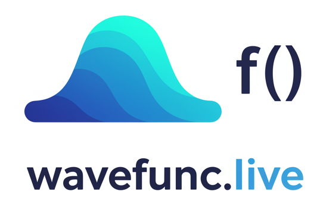

# WaveFunc

A decentralized internet radio registry built on Nostr, offering music recognition capabilities and favorites management. This application is also referred to as NostrRadio in the specification documents.

<div align="center">
  
</div>

## Features

- 🎵 **Radio Station Streaming**: Listen to radio stations from around the world.
- 📻 **Radio Station Registry**: Define and discover radio stations using Nostr events (Kind 31237).
- 🔍 **Dedicated and Indexed Relay**: Ligthning fast radio station search.
- ⭐ **Favorites Management**: Create and manage lists of your favorite stations using Nostr events (Kind 30078).
- 큐 **Featured Station Lists**: Discover curated collections of radio stations.
- 🔑 **Nostr Authentication**: Seamless login with your Nostr key (including NIP-46 for remote signing).
- 🌐 **Decentralized**: Built on the Nostr protocol for censorship resistance and data portability.
- 📱 **Responsive Design**: Works on desktop and mobile devices.
- 🔗 **NIP-89 Handler Support**: Declares itself as a handler for radio station events (Kind 31990).

## Tech Stack

- **Frontend**: React, TailwindCSS, Vite, Tanstack Router
- **Backend**: Bun
- **Nostr**: NDK (Nostr Development Kit), NIP-07, NIP-46
- **Database**: PostgreSQL (for caching/indexing Nostr events - optional, primarily relies on Nostr relays)
- **Deployment**: Nginx, Railway
- **Music Recognition**: AudD API via DVM (Nostr Data Verification Method)
- **Specification**: Follows NostrRadio event kinds and formats (see `SPEC.md`)

## Development Setup

### Prerequisites

- [Bun](https://bun.sh/) v1.x or higher
- [Node.js](https://nodejs.org/) v18.x or higher
- [Git](https://git-scm.com/)

### Getting Started

1. Clone the repository:

```bash
git clone https://github.com/zeSchlausKwab/wavefunc.git
cd wavefunc
```

2. Install dependencies:

```bash
bun install
```

3. Set up environment variables:

```bash
cp .env.sample .env
```

Edit the `.env` file and fill in the required values (see Environment Variables section).

4. Start the development server:

```bash
bun run dev
```

This will start all services:

- Web app: http://localhost:8080
- Backend API: http://localhost:3001
- Relay: ws://localhost:3002

### Environment Variables

The following environment variables are required:

```
VITE_PUBLIC_APP_ENV=development
PUBLIC_HOST=localhost
PUBLIC_RELAY_PORT=3002
PUBLIC_WEB_PORT=8080
PUBLIC_API_PORT=3001
PUBLIC_BLOSSOM_URL=<url>
# Add your Nostr pubkey if you are running a DVM or want to publish curated lists
# NOSTR_PUBLIC_KEY=<your_nostr_pubkey_hex>
# NOSTR_PRIVATE_KEY=<your_nostr_private_key_hex> # Keep this safe!
```

> **Important:** When testing features like NIP-46 login or using the app from other devices on your network, set `PUBLIC_HOST` to your machine's local IP address (e.g., `192.168.1.x`) instead of `localhost`. This ensures proper communication between devices on your network. The `NOSTR_PUBLIC_KEY` and `NOSTR_PRIVATE_KEY` are primarily for application-level event publishing (e.g. featured lists, NIP-89 handler events if the app itself publishes these). User-specific actions are signed by the user's client.

For production, you'll also need:

```
POSTGRES_USER=postgres
POSTGRES_PASSWORD=<your-password>
POSTGRES_DB=nostr
POSTGRES_PORT=5432
POSTGRES_HOST=localhost
```

## Project Structure

```
/apps
  /web          # React frontend
  /devices      # app (coming soon)
/infra
  /blossom      # blossom
  /dvm          # Data Verification Method service (for music recognition)
/packages       # Shared code (e.g., Nostr types, utilities)
/docs           # Documentation, including SPEC.md
```

## Development

### Available Commands

- `bun run dev`: Start all services in development mode
- `bun run dev:web`: Start only the web frontend
- `bun run dev:backend`: Start only the backend API
- `bun run dev:relay`: Start only the Nostr relay
- `bun run dev:dvm`: Start only the DVM service
- `bun run build`: Build the application for production
- `bun run test`: Run tests
- `bun run format`: Format code using Prettier

## Specification Adherence

WaveFunc / NostrRadio follows the event kinds, content formats, and tag structures defined in `SPEC.md`. Key kinds include:

- `31237`: Radio Station Event
- `30078`: Favorites List & Featured Station Lists
- `31990`: NIP-89 Handler Event

Refer to `SPEC.md` for detailed information on event structures, tags, and content formats.

## License

[MIT License](LICENSE)

## Contributing

Contributions are welcome! Please feel free to submit a Pull Request.

1. Fork the repository
2. Create your feature branch (`git checkout -b feature/amazing-feature`)
3. Commit your changes (`git commit -m 'Add some amazing feature'`)
4. Push to the branch (`git push origin feature/amazing-feature`)
5. Open a Pull Request

```

```
