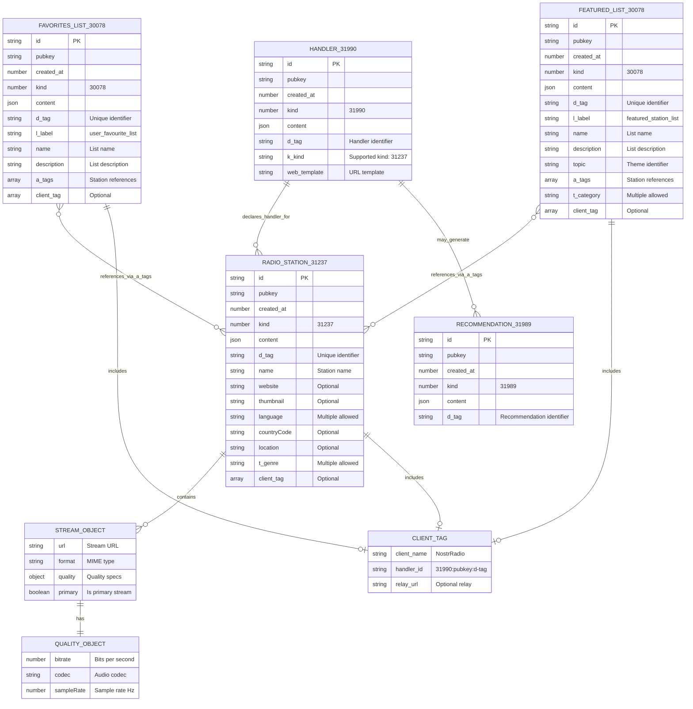

# NostrRadio Event System Diagram

This diagram shows the relationships between different event types in the NostrRadio specification.

## Event Relationships

1. **Radio Station Events (31237)** - Core station definitions with streams and metadata
2. **Favorites Lists (30078)** - User collections of favorite stations  
3. **Featured Lists (30078)** - Curated collections with same kind but different label
4. **Handler Events (31990)** - App declarations as station handlers
5. **Recommendation Events (31989)** - Handler-generated recommendations

### Key Relationships

- **Lists reference stations** via 'a' tags containing station event IDs
- **Handlers declare support** for station events via 'k' tags
- **All events can include client tags** referencing handlers for attribution
- **Stations contain stream objects** with quality specifications
- **Both list types use kind 30078** but are distinguished by their 'l' label tag